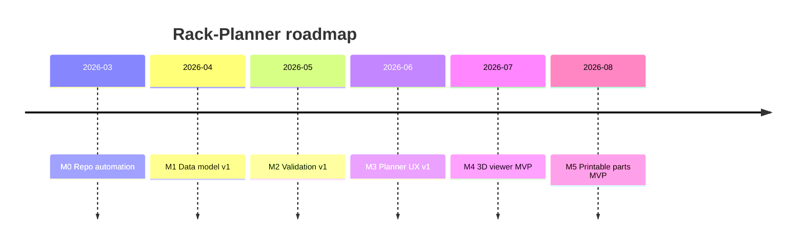
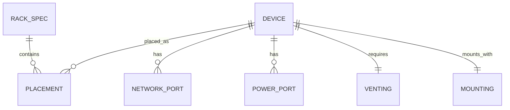

# Rack-Planner


A web app for planning **10-inch mini rack** builds with a device metric library,
U-position planning, fit validation, and future support for 3D viewer and
parametric printable parts.

## Project status

| Area | Status |
| --- | --- |
| Repo automation | In progress |
| Backend API | `v0.1.0` / `/api/v1` draft |
| Frontend | Alpha |
| Validation | Basic fit, overlap, width, depth-clearance |
| 3D viewer | Planned |
| Printable part generator | Planned |

This repository is being structured so both **humans and AI agents** can extend
it with minimal hand-holding.

## Quick start

### Requirements

- Python 3.11+
- Node 18+
- Docker Desktop or Docker Engine (optional, recommended)

### Run locally without Docker

Backend:

```bash
cd backend
python -m venv .venv
# macOS/Linux
source .venv/bin/activate
# Windows PowerShell
# .venv\Scripts\Activate.ps1

pip install -e ".[dev]"
uvicorn rack_planner.app:app --reload --port 8000
```

Frontend:

```bash
cd frontend
cp .env.example .env
npm install
npm run dev -- --port 5173
```

Open:

- Frontend: http://localhost:5173
- Backend health: http://localhost:8000/health
- Backend devices API: http://localhost:8000/api/v1/devices

### Run with Docker

```bash
docker compose up --build
```

Open:

- Frontend: http://localhost:5173
- Backend: http://localhost:8000

## Repository tour

- `backend/rack_planner/app.py` — FastAPI application and API routes
- `backend/rack_planner/schemas.py` — canonical backend data models
- `backend/tests/` — backend smoke tests and device-library tests
- `frontend/src/` — React UI
- `data/devices/` — device metric libraries
- `docs/architecture.md` — system design
- `docs/test_plan.md` — executable testing strategy
- `docs/tasks/` — atomic task template for AI/human contributors

## API

Current stable draft endpoints:

- `GET /health`
- `GET /api/v1/devices`
- `POST /api/v1/validate`

Legacy compatibility endpoints are still present for the early scaffold:

- `GET /devices`
- `POST /validate`

## Development milestones

| Milestone | Goal | Status |
| --- | --- | --- |
| M0 | Repo automation: packaging, CI, Docker, env config | In progress |
| M1 | Data model v1 and default device library | In progress |
| M2 | Validation v1: overlap, clearance, venting | Planned |
| M3 | Planner UX v1: drag-and-drop and accessibility | Planned |
| M4 | 3D viewer MVP | Planned |
| M5 | Parametric printable parts MVP | Planned |



## Data model overview



## How humans and AI agents should work in this repo

1. Start from `README.md`, then read `docs/architecture.md`.
2. Pick or create a task file from `docs/tasks/TEMPLATE.md`.
3. Make only atomic, reviewable changes.
4. Run the validation commands listed in the task.
5. Ensure CI can verify the change.
6. Keep commit messages explicit and small.

### Definition of a good task

A good task in this repo has:

- a clear scope
- exact files to modify
- acceptance criteria
- validation commands
- known dependencies

## Default device library

`data/devices/default_devices.json` is the stable baseline device library used
for CI and demos. It currently includes:

- 8-port gigabit switch
- 16-port PoE switch
- 12-port patch panel
- 2U mini UPS
- 1U mini PDU

## Validation scope today

Current backend validation checks:

- rack height overflow
- U-slot overlap
- width vs rack usable width
- depth vs rack depth minus rear/cable clearance

Planned next checks:

- venting rules
- cable route constraints
- power budget checks
- thermal heuristics

## Commit-ready commands

Before committing:

```bash
# backend
cd backend
pip install -e ".[dev]"
pytest

# frontend
cd ../frontend
npm install
npm run build
```

## License

MIT. See `LICENSE`.
